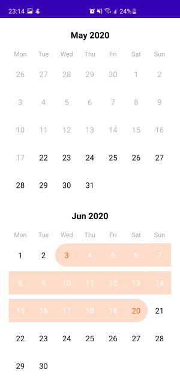

# Date-Range-Select-on-Calendar-Android

How to implement dependecy

1. add your xml 
     <com.narektonakanyan.calendarlibrary.calendarView.CalendarView
        android:id="@+id/calendar_view"
        android:layout_width="match_parent"
        android:layout_height="match_parent" />
2. add your kotlin code
            val start = Calendar.getInstance().apply { set(Calendar.YEAR, get(Calendar.YEAR) - 1) }.apply { timeInMillis += 20 * 86400000 }
            val end = Calendar.getInstance()
            calendarView.setupData(start, end)        




####  For implementation

```gradle
allprojects {
    repositories {
	maven { url 'https://jitpack.io' }
    }
}
	
dependencies {
	implementation 'com.github.NTonakanyan:Android-Exception-library:Tag'
}
```
